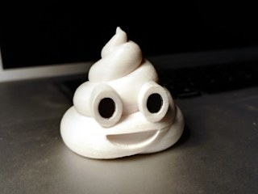
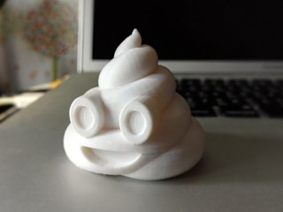
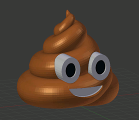

# Pile of Poo Emoji (U+1F4A9)
*3D printable rendition of the Pile of Poo a.k.a. Smiling Turd Emoji U+1F4A9 (formerly thing:1682665)* 💩

### License
[Creative Commons - Attribution](https://creativecommons.org/licenses/by/4.0/)

### Gallery

[🔎](images/Turd1.jpg) [🔎](images/Turd1.jpg) [🔎](images/turd-model.png)

## Description and Instructions

Unsatisfied with the looks of the existing models of the poop emoji aka smiling turd, I made my own from scratch to be as faithful to the 2D original as possible. Eventually the best method proved to actually mimic the process of depositing a long sausage onto a flat surface, by applying the Curve modifier in Blender with a hand-crafted spiral. In a sense, I simulated the process of depositing poop using high-tech. Ah, the joys of technology!

Models are included for either:
1. **Single material printers:** `TurdEmoji-single_mat`
2. **Dual material printers:** `TurdEmoji-dual-or-multi-mat1` + `TurdEmoji-dual-mat2`
3. **Multi-material printers:** `TurdEmoji-dual-or-multi-mat1` + `TurdEmoji-multi-mat2` + `TurdEmoji-multi-mat3`

The ‘Filled’ variants do not have the inside spiral, and may print faster and with less material when using a low infill value. They are probably the most convenient for making remixes.

If you print the single model or the two-material model, the inside of the eyes can be coloured with a sharp permanent marker, which is easier than trying to paint them.

If you don't have a multi-material printer and want to manually print and assemble parts printed in different colors, look in the **parts-for-assembly** folder.

A Blender file with the non-merged parts is also available for easier remixing.

I did my best to remove self-intersecting volumes, MeshLab still shows a few intersecting faces but it shouldn't cause any problems with any decent slicer.

If you really like this, you can [show your appreciation with a small donation](https://www.dr-lex.be/about/#contact).

## How I printed this

Printing should be easy, no rafts or supports required. For the more challenging filaments, you may need to force infill across the entire model to avoid that gaps occur at the seams between the ‘sausage’ due to shrinking of the material (especially with ABS).

I printed at 0.2 mm layers, 15% infill, without any rafts or supports. The print shown in the photos is ABS at 75% size.

If you have trouble printing the mouth, you could enable supports for only that region, but a good cooling fan should make supports unnecessary.

## License clarification: read this before contacting me

This model is released under a *Creative Commons - Attribution* license. The details can be [found here](http://creativecommons.org/licenses/by/4.0/), but my interpretation of this license is that you are pretty much free to do anything with this model including selling prints, **if** you comply with the following condition:

* **‘Attribution’** means you must always provide a visible reference to the origin of the model both on the webpage where you publish or sell the model, and inside the packaging of any physical product that includes a print of this model or an obvious derivative. A link to this page or even just “[Pile of Poo model by Dr. Lex](https://github.com/DrLex0/print3D-pile-of-poo-emoji)” suffices, as long as there is no possibility that anyone could believe you are the author of the model because you are selling it or publishing it somewhere. 
  As for paper print-outs, simplest is to use the ready-to-print attribution cards in PDF format that can be found in this repository. 
  *This is a very, very easy requirement* that doesn't incur any extra cost except a minute of your time. If you skip this tiny simple effort and catch enough attention, it might end up costing much more than you gained from it.

## Updates

### 2016/07/20
First published on Thingiverse.

### 2017/06/11
Added multi-material files for printing the pupils in a third color on printers that can print with 3 materials.

### 2017/09/20
Added high poly count models for those wanting to print highly detailed poop.

### 2018/06/12
Updated the hiPoly models to have a better footprint to avoid warping around the mouth area, and some polygon pushing to encourage slicers to place seams inside the spiral crease.

### 2020/04/01
Migrated to GitHub.

### 2022/08/07
Added ‘filled’ variants and updated Blender file to allow generating all STLs from it. (The default produces the single-material model. You will have to figure out the right combination of Boolean operators to produce the other variants.)

## Tags
`crap`, `dual_extrusion`, `EMOJI`, `internet`, `Multicolor`, `poo`, `poop`, `Poop_emoji`, `shit`, `smile`, `smiley`, `U+1F4A9`
