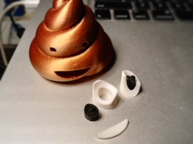

# Pile of Poo Emoji multi-part
*3D printable rendition of the Pile of Poo emoji, printable in separate parts to be glued together (formerly thing:2958572)*

### License
[Creative Commons - Attribution](https://creativecommons.org/licenses/by/4.0/)

### Attribution
This is the same kind of multi-part remix of my [Pile of Poo](https://github.com/DrLex0/print3D-pile-of-poo-emoji) model as DerBaer86 has made ([Thingiverse thing:2365386](https://www.thingiverse.com/thing:2365386)), but with some improvements.

### Gallery

[🔎](images/MultiTurd1.jpg) [🔎](images/MultiTurd2.jpg) [🔎](images/MultiTurd3.jpg)

## Description and Instructions

This variation on my original ‘Pile of Poo’ emoji can be printed in different materials on a single-material printer as separate parts, which then need to be assembled afterwards for a multi-colour result.

This version has the following improvements over DerBaer86's version:
* It is the more detailed high-poly model,
* It also has a separate mouth,
* The mounting pegs for the eyes are larger hence have less risk of breaking when pushing them in,
* There is a bit of extra tolerance on the pegs so you can more easily push them in,
* The bottom part has been improved to get rid of the overhangs in the first few layers, this avoids the risk of warping around the mouth area (the original models have now been updated with the same improvement as well),
* Some polygon pushing to encourage slicers to place seams inside the spiral crease.

Print all parts in the desired colors, then push the pupils into the eyes from the rear side. Don't push them in all the way, they will automatically align when pushing the eyes onto the turd. Apply a bit of glue on all parts and push them in the right places. I recommend epoxy resin because it cures pretty quickly while still allowing enough wiggling time, and it has good filling properties while also being very strong.

## How I printed this

0.2 mm layers, 15% infill, no rafts or supports.

No supports needed. The models in the photos were printed at 80% size with 0.15 mm layers. If you have a hard time pushing the pupils into the eyes, scale them down to 99% or a bit less. It may also help to sand their edges if your first layer is wider due to being squashed.

# Licensing

[See the main README of this repository](https://github.com/DrLex0/print3d-pile-of-poo-emoji) for the details.

## Tags
`crap`, `EMOJI`, `internet`, `Multicolor`, `poo`, `poop`, `Poop_emoji`, `shit`, `smile`, `smiley`, `U+1F4A9`
